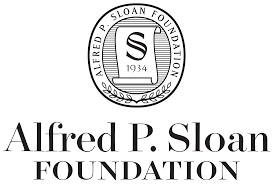

The Carpentries is a fiscally sponsored project of the 501(c)3 [Community Initiatives](http://communityin.org/)

### Our Member Organisations

A Member Organisation is an organisation that has made a committment to
the growth and spread of The Carpentries and building capacity for training
at their local organisation. See more on [becoming a Member Organisation](../membership/) and our list of [Current Member Organisations](../memberorgs/).

### Sponsors and Donors

We have received support from:

