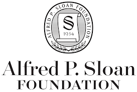
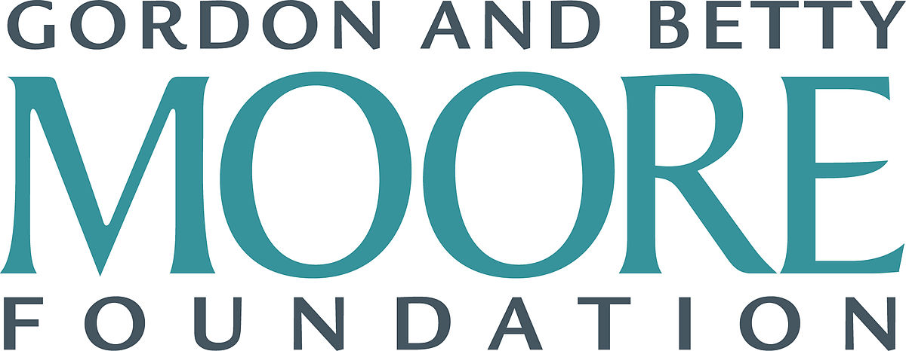

The Carpentries is a fiscally sponsored project of the 501(c)3 [Community Initiatives](http://communityin.org/)

### Our Member Organisations

A Member Organisation is an organisation that has made a financial committment to
the growth and sustainability of The Carpentries and is building their local capacity for training. See more on [becoming a Member Organisation](../membership/) and our list of [Current Member Organisations](../memberorgs/).

### Sponsors and Donors

We have received support from:

### Additional Supporters

- United States Department of Agriculture
- Lawrence Berkeley Laboratory
